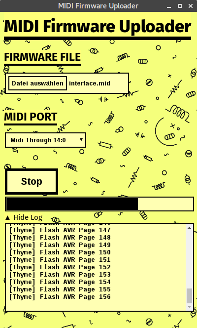

# Sysex Playback App

Standalone program for Linux/MacOS/Windows to send firmware updates packed into a MIDI file to a device.

## Motivation

To update the firmware of devices which do not have a dedicated communication port for this (like ISP header) we can use the MIDI port.
You need to boot to some kind of bootloader mode which will listen for dedicated System Exclusive messages that carry the firmware update and apply it.
As messages need some time to be processed and cannot be buffered on the device one needs to make sure to not send them too fast after another.

One way to achieve this is to set a global delay between messages. This is what common tools like [SysEx Librarian](https://www.snoize.com/SysExLibrarian/) and [MIDI-OX](http://www.midiox.com/) are doing. It works but it's not very convenient and defining a common delay for all messages might slow down the process unnecessarily. Furthermore, theses tools are specific to a certain operating system.

## Builds

| Operating System | Details |
| ----| --------|
| Linux | AppImage compiled on Debian Stretch amd64 |
| MacOS | DMG compiled on High Sierra 10.13.1 |
| Windows | Portable and Installer compiled on Windows 7 32bit |
